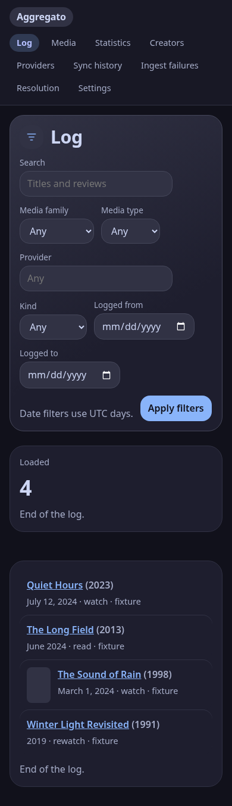

# Browser validation and screenshots

Checked on 1 October 2026 against the production frontend build served by the local API on
loopback. The archive contains the five invented records in
[`log-two-pages.jsonl`](../../tests/fixtures/fixture/log-two-pages.jsonl). The fixture provider was
then disabled; no scheduler was running. Image acquisition was disabled, and browser requests to
other origins were blocked. No personal data or live provider credentials were used.

Validation tools were installed under `/tmp`, without changing application dependencies:
Playwright 1.63.0, Chromium 153.0.8010.12, and axe Playwright 4.13.0. The checks used the actual API,
cookies, and built Vue application rather than mocked browser responses.

## Results

- Axe reported zero violations for its WCAG 2 A/AA and 2.1 AA rules in 13 view checks: the public
  log; operator dashboard, log, media, creators, providers, sync history, ingest failures,
  resolution, statistics, settings; and one work and creator detail each. No page errors occurred.
- Keyboard tab order starts at the visible skip link, proceeds through the primary navigation,
  and reaches the sign-in field. The skip link focuses `main`. Focus outlines were present.
- Sign-in and a title search completed using the keyboard. Searching for “Quiet Hours” returned
  that record alone.
- Submitting an empty required provider configuration activated native validation and sent no
  configuration PUT request.
- Dashboard, log, providers, and settings had no document-level horizontal overflow at either
  720px or 390px viewport width. These are responsive layout checks, not a complete zoom audit.
- Screenshots below were inspected for readable labels, wrapped navigation, visible controls,
  and unclipped content.

Axe could not determine contrast over gradient backgrounds. This was reported as incomplete,
not a passing contrast test. Full browser zoom and testing with screen-reader users remain manual
checks. Chromium's headless keyboard zoom shortcut did not change the viewport or device scale;
that attempt is not counted as a 200% zoom result. Automated rules and these limited interactions
do not establish complete accessibility conformance.

## Screenshots

Desktop captures use a 1440px viewport; the mobile log uses 390px. They intentionally show the
fixture source and its disabled state.

| View | Image |
|---|---|
| Dashboard | [Desktop](screenshots/dashboard-desktop.png) |
| Log | [Desktop](screenshots/log-desktop.png), [Mobile](screenshots/log-mobile.png) |
| Providers | [Desktop](screenshots/providers-desktop.png) |
| Settings | [Desktop](screenshots/settings-desktop.png) |

